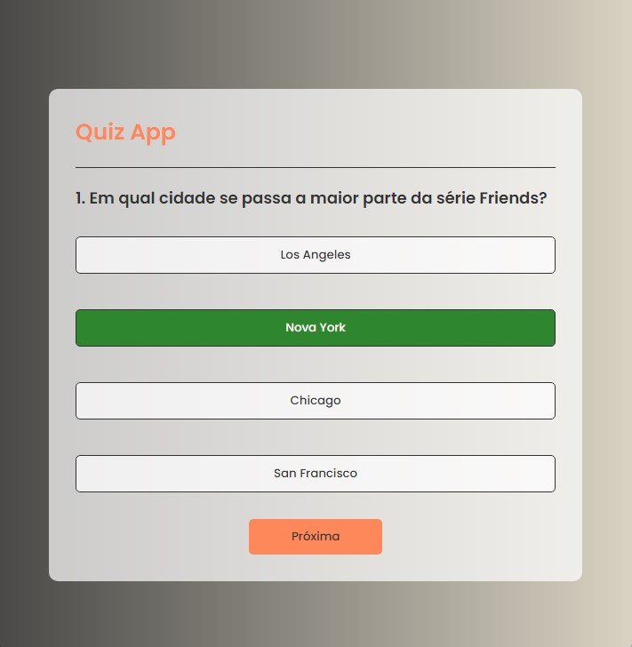

# Quiz App

Este é um aplicativo de quiz interativo foi desenvolvido com **HTML**, **CSS** e **JavaScript**. Ele exibe uma série de perguntas e respostas e calcula a pontuação final com base nas respostas corretas. O tema do Quizz são séries de TV famosas.

## Funcionalidades

- Apresenta uma série de perguntas com múltiplas opções de resposta.
- Mostra o feedback visual indicando se a resposta selecionada está correta ou incorreta.
- Exibe a pontuação final ao término do quiz.
- Permite reiniciar o quiz ao final para jogar novamente.

## Tecnologias Utilizadas

- **HTML**: Estrutura do conteúdo.
- **CSS**: Estilos e layout da aplicação.
- **JavaScript**: Lógica do jogo e interação com o usuário.

## Aplicativo em funcionamento



## Como Executar

1. Faça o download ou clone o repositório:

   ```bash
   git clone https://github.com/kimbioni/quizApp.git
